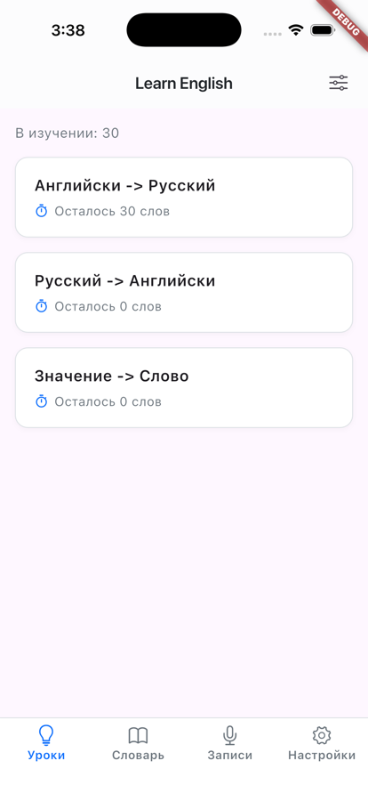
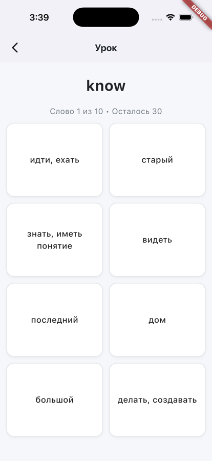
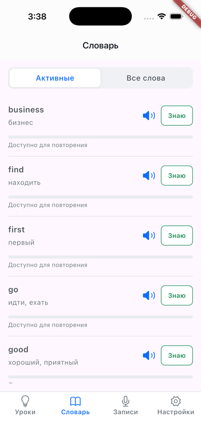
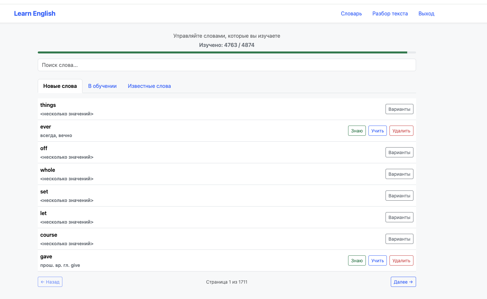
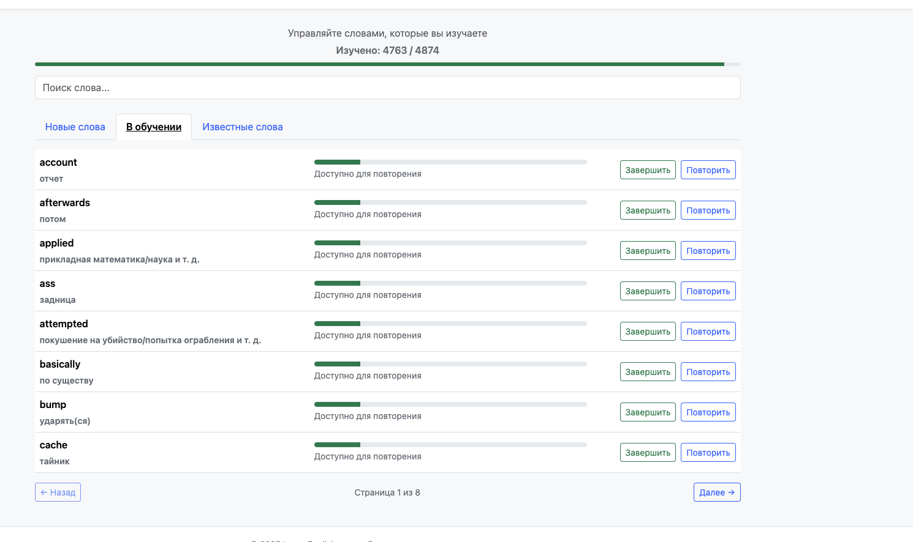
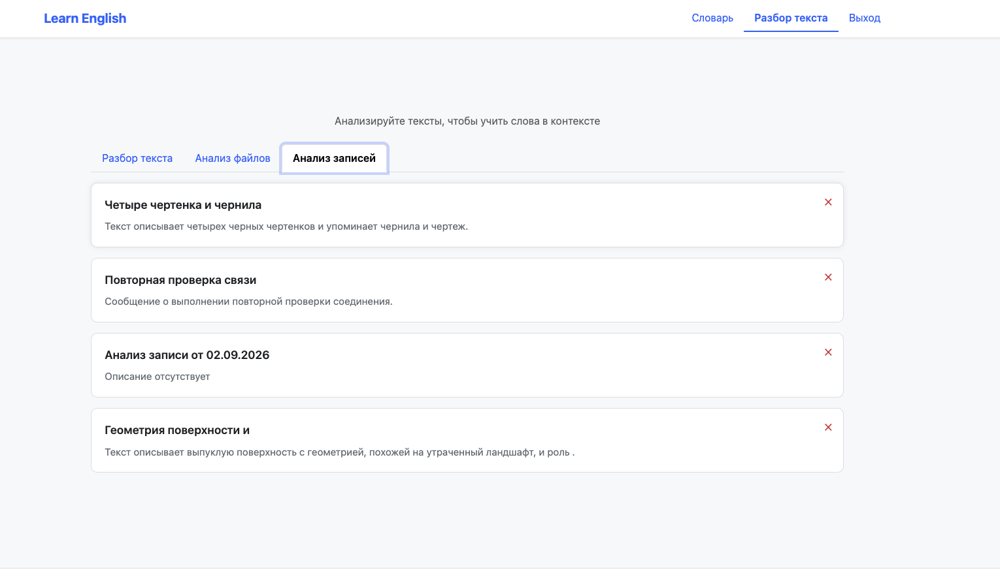

# Learn English — showcase

A personal language-learning product I built end to end: a mobile app, a web client, a backend API, and an AI pipeline that turns spoken English into vocabulary and feedback.

> This is a **read-only snapshot of the client code** (Flutter app and web) for review, not a runnable project. The backend, the AI services, secrets, infrastructure, audio assets, and Firebase / signing configuration are not included. Values that used to be hard-coded now come from build-time variables.

## Demo

The UI is in Russian: the app is built for Russian speakers learning English.

### iOS app (Flutter)

| Lessons | Quiz | Dictionary |
|---|---|---|
|  |  |  |

**Lessons:** three exercise types (English → Russian, Russian → English, meaning → word) over the words currently in training. **Quiz:** pick the right translation; a word counts as learned after two correct answers in a row. **Dictionary:** active words with pronunciation, review status, and a "known" action.

### Web client

**Vocabulary: new words.** My own dictionary: 4,874 words, 4,763 already learned. A new word can be marked as known, sent to training, or removed; words with several meanings open a picker.



**Vocabulary: in training.** Words being practiced, with progress toward "learned" and a review action.



**Recording analysis.** Voice recordings after speech-to-text and the LLM pass; each gets a generated title and a short summary.



## What the whole product does

- **Build vocabulary from any text.** Paste a text or a book chapter; the backend splits it into sentences, extracts words, matches them against a dictionary, and uses an LLM to explain the ones you don't know yet.
- **Train.** Quiz-based lessons on your own word list, with training records and statistics per word pair.
- **Speak and get feedback.** Record yourself on the phone; the audio goes through speech-to-text (Whisper) and an LLM pass that fixes recognition errors, summarizes, and translates. Results show up in the app when ready.
- **Sign in with Google** on iOS, Android, and web; the backend issues its own JWT.

## Architecture

```
 Flutter app (iOS / Android)        Web (Vite)          ← this repository
            │                          │
            └──────── REST + JWT ──────┘
                         │
          Backend (Spring Boot, Java + Kotlin)           ← not included
           │            │               │
       MongoDB   Speech-to-text     Text analyzer (Python)
                   (Whisper)               │
                                    LLM (vLLM, OpenAI-compatible API)
```

The recording flow is asynchronous: the app uploads audio, the backend sends it to speech-to-text, then to the analyzer and the LLM, and each step reports back through a callback. The app polls the recording status and shows the result when it's ready.

## Repository layout

| Path | What's inside |
|---|---|
| `flutter/` | Mobile client: pages (`main_page` lessons, `quiz_page`, `dictionary`, `recordings_page`, `login`, `setting_page`), services (auth, audio, dictionary, parser, config), networking with connectivity handling |
| `web/` | Vanilla JS + Vite client for the same API |
| `docs/` | Screenshots |

## Stack

Flutter / Dart · Google Sign-In · Vite. The full product also uses Spring Boot (Java + Kotlin), MongoDB, Python, Whisper, and vLLM on a self-hosted GPU Kubernetes cluster.

## Build-time configuration

| Variable | Used by |
|---|---|
| `API_HOST`, `GOOGLE_SERVER_CLIENT_ID` | Flutter: `--dart-define` |
| `VITE_API_BASE_URL`, `VITE_GOOGLE_CLIENT_ID`, `VITE_GA_ID` | web: `.env.local` |

## Author

Denis Chilik · [denis.chilik.net](https://denis.chilik.net) · [LinkedIn](https://www.linkedin.com/in/denis-chilik-b0428a82)
